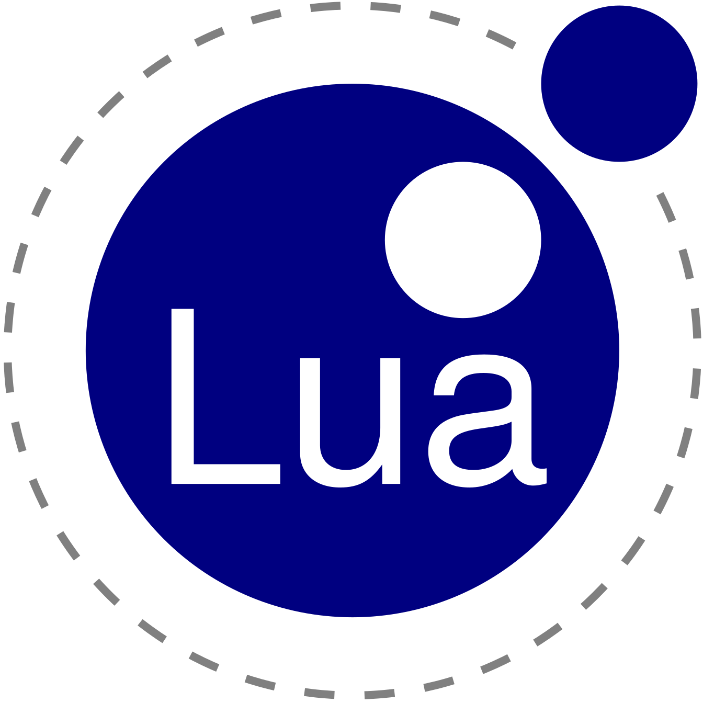
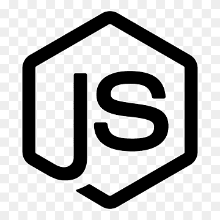

<h1 align="center"> 
      
        Welcome to my profile! 
     </h1>

    

    
Its quite a boring one right now, but only because I have no clue what to make that would be worthy enough of being put on here.  
There will eventually be various projects here coded and non coded!
    

<h2 align="center"> 
     
        
        A short excerpt about me 
        
     
</h2>

Heya, my name's Chloe. 

I am an aspiring software engineer with a passion for creating things and improving my skills!

I am a Star rail enthusiast ᵃᵈᵈᶦᶜᵗ and would list more games but there would be too many  
Don't be surprised if there ends up being a lot of Star rail related repositories on my profile at somepoint
 
 
Semi experienced in 3d modeling with Blender 
 
 
 
Decent knowledge for a majority of Unity features - Primarily for vrchat related things  
 
 
 
Light knowledge of photo manipulation in Affinity photo 
 
 
 
Slightly experienced programming - Still struggle with some more complex topics - (Known langs below) 
 
 
 
I know a consistent path to improving my skills 
 
 
 
Interested in reverse engineering - Both software and hardware side - Not capable yet though
 
 

    

<h2 align="center">

Visualized list of what I know and use

</h2>

~ Langs and Frameworks I am comfortable with ~

~ Langs and Frameworks I am learning ~

~ Langs and Frameworks I want to learn ~

~ Programs I use ~

<h2 align="center"> Thank you for reading! </h2>

<!--

    
~ Programming languages I am comfortable with ~
-->

<!--

-->
<!--
75% ---- 50%

~ Programming languages I am uncomfortable in, but am learning ~

30% ---- 5% ---- 7% ---- 5%

~ Programming languages I want to learn ~

-->
